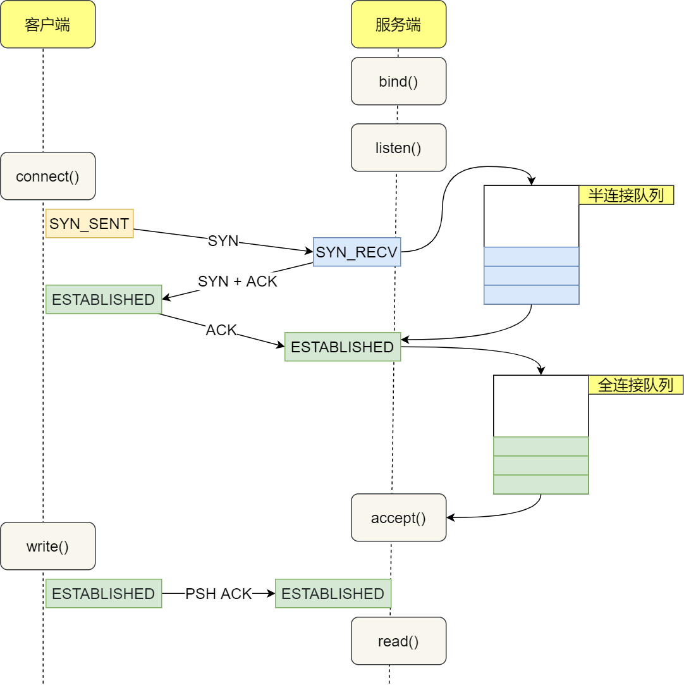

# TCP常考问题汇总

### TCP连接为什么要进行三次握手？
TCP连接建立时需要在双方都维护一个序列号(ISN)并通知对方；基于这个序列号，接收消息的一方才可以知道目前收到的消息是否重复、连续；这是TCP能保证可靠连接的基础。
而TCP是一个双工的协议，为了保证双方都可以可靠通信，必须经过三次握手，让双方都初始化一个ISN并告知另一方。
两次握手是不够的，四次握手则没有必要。

```
Client  Server
    ->SYN
    <-ACK/SYN
    ->ACK
```

### 在TCP中什么是半连接队列？
Linux内核针对TCP协议会维护两个队列分别是 syn队列 和 accept队列。
内核收到 syn 请求的时候就会将连接放入 syn队列 也就是半连接队列；当收到第三次握手的ACK时候，则会将连接从半连接队列中移除，放入 accept队列 等待系统调用 accept 将连接取出，并进行后续 read 等操作。


### 什么是TCP粘包现象？
TCP是基于字节流的传输层协议；应用层的消息可能会被拆分重组成一个数据段发给目标主机。
比如Nagle算法就是这样一种拆分重组从而减少数据包数量进而提高TCP传输效率的算法；它就会导致粘包现象的出现。应用层一次传输的数据若不多；则会暂存于系统缓冲区，等待下次请求的数据来临；如果两次的数据之和超过MSS的大小，则会将数据拆成MSS+剩余大小，分两次进行发送。则应用层分离的两个消息被放入了同一个segment；即粘包现象。
解决方案就是定义清楚消息的边界；通常可以采用确定长度或增加终结符两种方案进行解决。